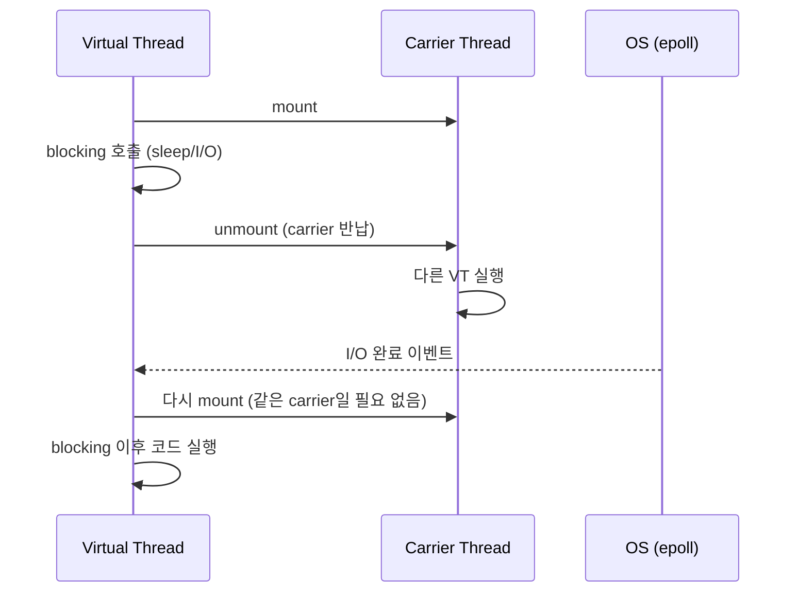

# Virtual Thread 복기 시트 — Chapter 1~2

---

## 1. 플랫폼 스레드의 한계

### OS 스레드 1:1 대응과 메모리 문제

플랫폼 스레드는 OS 스레드와 1:1 대응한다. I/O 대기 중 스레드가 블로킹되면
그 스레드는 아무 일도 하지 않으면서 **~1MB 스택을 점유**한다.

```
동시 요청 10,000개
→ OS 스레드 10,000개 필요
→ 스택만 ~10GB 소비
```

### 풀 크기가 병목이 되는 이유

스레드 풀의 모든 스레드가 블로킹되면 새 요청이 대기 큐에 쌓인다.

```
풀 크기 200, 작업 1000개, I/O 20ms
→ Math.ceil(1000 / 200) = 5 배치
→ 5 × 20ms = 100ms+
```

### 풀을 무한정 키우면 안 되는 이유

풀을 2000으로 늘리면 오히려 느려진다.

| 문제 | 설명 |
|------|------|
| 스레드 생성 비용 | OS 스레드 생성 = 스택 할당 + OS 등록 |
| 관리 오버헤드 | 실제 작업은 1000개인데 2000개 관리 |
| 메모리 압박 | 스택 증가 → GC 영향 |

적정 풀 크기:
- CPU bound → 코어 수 근방
- I/O bound → 경험적 튜닝 필요

> Virtual Thread는 이 튜닝 고민 자체를 없앤다.

---

### ⚠️ 헷갈리기 쉬운 것

**"blocking = OS 스레드 점유"는 플랫폼 스레드 얘기**

OS 내부에는 Wait Queue(I/O 대기)와 Run Queue(CPU 실행 대기)가 분리되어 있다.
Wait Queue에 있는 스레드는 CPU를 소비하지 않는다.
플랫폼 스레드의 진짜 문제는 CPU가 아니라 **메모리(스택)와 컨텍스트 스위칭 비용**이다.

```
Run Queue  → CPU가 실행 중인 것들  ← CPU 소비 O
Wait Queue → I/O 대기 중 park     ← CPU 소비 X, 메모리만 점유
```

---

## 2. Virtual Thread가 I/O를 처리하는 방법

### carrier thread mount/unmount 메커니즘

VT가 blocking 작업을 만나면 carrier thread에서 **unmount**된다.
carrier는 즉시 다른 VT를 실행한다.
I/O 완료 후 JVM 스케줄러가 VT를 다시 mount한다.



### JVM 내부에서 non-blocking으로 변환

개발자는 blocking 코드를 짜지만 JVM이 내부적으로 non-blocking syscall(epoll/kqueue)로 변환한다.
OS 입장에선 처음부터 blocking이 없었던 것처럼 동작한다.

```
개발자: Thread.sleep(20)  ← blocking 코드
JVM:   타이머 등록 → VT unmount → carrier 반납
OS:    20ms 후 이벤트 → JVM이 VT 재스케줄링
```

### 실제 OS 스레드는 몇 개 쓰이나

carrier thread는 ForkJoinPool 기반이며 기본 크기는 **CPU 코어 수**다.
1000개 VT가 동시에 sleep 중이어도 carrier는 코어 수만큼만 사용된다.

```
VirtualThread[#42]/runnable@ForkJoinPool-1-worker-3
              ^^^                          ^^^^^^^^
         JVM 내부 VT ID              실제 OS 스레드 (carrier)
         (순번, OS 무관)              (코어 수 이하로만 나옴)
```

---

### ⚠️ 헷갈리기 쉬운 것

**VT가 blocking 중일 때 carrier는 안 잡혀있다**

```
[잘못된 이해]
VT → blocking → carrier OS 스레드도 같이 대기

[실제]
VT → blocking → carrier unmount → carrier는 다른 VT 실행
                                 → VT 상태는 JVM 힙에 저장
```

carrier thread가 코어 수로 제한되는 것은 **CPU 연산**에 대한 한계다.
I/O 대기는 carrier를 점유하지 않으므로 그 한계를 받지 않는다.

---

## 3. Virtual Thread 기초 API

### 생성 방법 5가지

```java
// 1. builder + start
Thread.ofVirtual().start(runnable);

// 2. convenience
Thread.startVirtualThread(runnable);

// 3. unstarted (수동 start 필요)
Thread vt = Thread.ofVirtual().unstarted(runnable);
vt.start();

// 4. factory
ThreadFactory factory = Thread.ofVirtual().factory();
factory.newThread(runnable).start();

// 5. executor (가장 일반적)
ExecutorService executor = Executors.newVirtualThreadPerTaskExecutor();
executor.submit(runnable);
```

### 플랫폼 스레드와 다른 고정 특성

| 특성 | 플랫폼 스레드 | Virtual Thread |
|------|-------------|---------------|
| `isVirtual()` | false | **항상 true** |
| `isDaemon()` | 설정 가능 | **항상 true (고정)** |
| `getPriority()` | 1~10 설정 가능 | **항상 5 (NORM_PRIORITY)** |

### 기본 이름이 빈 문자열

```java
Thread vt = Thread.ofVirtual().unstarted(runnable);
vt.getName();  // "" (빈 문자열)

// 이름 지정하려면 명시 필요
Thread.ofVirtual().name("my-vt").unstarted(runnable);
```

플랫폼 스레드(`Thread-0`, `Thread-1`)와 달리 VT는 기본 이름이 없다.

---

### ⚠️ 헷갈리기 쉬운 것

**daemon=true가 고정인 이유**

```
JVM 종료 조건 = non-daemon thread가 모두 끝날 때

VT가 non-daemon이라면:
→ 수십만 개 VT가 전부 JVM 종료를 막음
→ main thread가 끝나도 JVM이 못 죽음

VT는 "작업 단위"로 설계된 존재
→ JVM 생명주기를 붙잡는 역할이 아님
→ daemon=true 강제
```

VT 작업 완료를 기다려야 한다면 `CountDownLatch` 또는 `executor.awaitTermination()`으로 **명시적으로** 기다려야 한다.

---

**shutdown() vs shutdownNow() vs interrupt() 차이**

| 방법 | 동작 | 강제 종료? |
|------|------|-----------|
| `interrupt()` | "그만해라" 신호. 스레드가 직접 감지해야 함 | X |
| `shutdown()` | 새 작업 안 받고 기존 작업 완료 대기 | X |
| `shutdownNow()` | 실행 중 스레드에 interrupt 신호 + 즉시 반환 | X |

어떤 방법도 스레드를 강제로 죽이지 않는다. 스레드 코드가 협조해야 실제 종료된다.

```java
// shutdownNow()해도 이 코드는 안 멈춤
executor.submit(() -> {
    while (true) {  // interrupt 확인 안 함
        doWork();
    }
});
```
